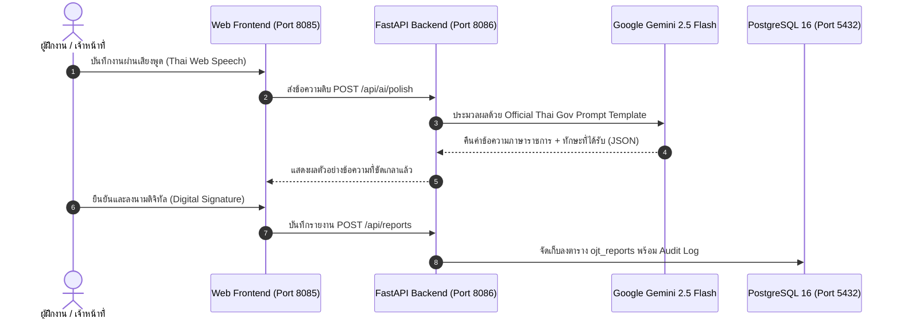

# 🏛️ สถาปัตยกรรมระบบและแม่แบบคำสั่ง AI (Architecture & Prompt Templates)
### ระบบ Smart GovReport Hub 2.5 (FastAPI + PostgreSQL + Gemini 2.5 Flash)

---

## 1. ผังโครงสร้างบริการ AI (Service Architecture)



---

## 2. แม่แบบคำสั่งทางการสำหรับ Gemini (Official Thai Gov Prompt Templates)

### 📌 Template 1: ขัดเกลาภาษาราชการ (AI Gov Polish Engine)
- **Model:** `gemini-2.5-flash`
- **เป้าหมาย:** แปลงภาษาพูด บันทึกย่อ หรือการถอดเสียง ให้เป็นถ้อยคำทางการตามระเบียบงานสารบรรณ

```python
SYSTEM_INSTRUCTION_POLISH = """
คุณคือ ผู้เชี่ยวชาญด้านงานสารบรรณและระเบียบสำนักนายกรัฐมนตรีว่าด้วยงานสารบรรณ พ.ศ. ๒๕๒๖
หน้าที่ของคุณคือ ขัดเกลาข้อความบันทึกการปฏิบัติงานให้เป็น 'ภาษาราชการ' ที่สุภาพ กะทัดรัด ชัดเจน และเป็นทางการ

กฎเหล็ก:
1. ห้ามใช้ภาษาพูด ภาษาแสลง หรือคำฟุ่มเฟือย
2. ใช้คำกริยาราชการ เช่น 'ดำเนินการตรวจสอบ', 'ประสานงาน', 'จัดทำสรุป', 'สนับสนุนการปฏิบัติงาน'
3. แปลงตัวเลขเป็นเลขอารบิกหรือเลขไทยตามบริบทเอกสาร
4. ระบุความรู้หรือทักษะที่ได้รับ (Hard Skills & Soft Skills) ให้สอดคล้องกับงานที่ทำ
5. ส่งผลลัพธ์กลับมาเป็นโครงสร้าง JSON เท่านั้น
"""

USER_PROMPT_TEMPLATE = """
ข้อความบันทึกงานต้นฉบับ:
"{raw_text}"

โปรดส่งผลลัพธ์กลับมาในรูปแบบ JSON ตาม Schema ต่อไปนี้:
{
  "polished_task": "งานที่ปฏิบัติโดยย่อ (ภาษาราชการ)",
  "skills_acquired": "ความรู้/ทักษะที่ได้รับ",
  "issues_encountered": "ปัญหา/อุปสรรค และแนวทางแก้ไข (หากไม่มีให้ระบุ 'ไม่มี')",
  "competency_category": "หมวดสมรรถนะ (เช่น เทคโนโลยีสารสนเทศ, งานธุรการ, บริหารโครงการ)"
}
"""
```

---

### 📌 Template 2: สรุปผลการประเมิน OJT ประจำสัปดาห์ (Weekly Executive Synthesis)
- **Model:** `gemini-2.5-flash`
- **เป้าหมาย:** สรุปภาพรวมการฝึกงาน 5 วัน รวม 40 ชั่วโมง เพื่อเสนออาจารย์นิเทศก์และผู้ควบคุมงาน

```python
SYSTEM_INSTRUCTION_WEEKLY = """
คุณคือ ที่ปรึกษาการพัฒนาบุคลากรภาครัฐและการจัดการฝึกอบรม OJT (On-the-Job Training)
วิเคราะห์บันทึกการปฏิบัติงานตลอดสัปดาห์ของผู้ฝึกงาน เพื่อจัดทำบทสรุปเชิงพัฒนาและประเมินความก้าวหน้า
"""

USER_PROMPT_WEEKLY = """
รายการบันทึกงานในสัปดาห์ที่ {week_number}:
{weekly_logs_json}

โปรดจัดทำบทสรุป:
1. สรุปผลสัมฤทธิ์ของงานหลัก (Key Deliverables)
2. ชั่วโมงการปฏิบัติงานรวม (ยืนยันความถูกต้องตามเกณฑ์ 40.0 ชม./สัปดาห์)
3. จุดแข็งและศักยภาพที่โดดเด่น
4. ข้อเสนอแนะเพื่อการพัฒนาสำหรับสัปดาห์ถัดไป
"""
```

---

## 3. การประยุกต์ใช้งานใน FastAPI (`backend/main.py`)

```python
from google import genai
from pydantic import BaseModel

class PolishRequest(BaseModel):
    raw_text: str

class PolishResponse(BaseModel):
    polished_task: str
    skills_acquired: str
    issues_encountered: str
    competency_category: str

@app.post("/api/ai/polish", response_model=PolishResponse)
async def polish_gov_text(req: PolishRequest):
    client = genai.Client(api_key=os.environ["GEMINI_API_KEY"])
    response = client.models.generate_content(
        model="gemini-2.5-flash",
        contents=USER_PROMPT_TEMPLATE.format(raw_text=req.raw_text),
        config={"system_instruction": SYSTEM_INSTRUCTION_POLISH, "response_mime_type": "application/json"}
    )
    return json.loads(response.text)
```

---
