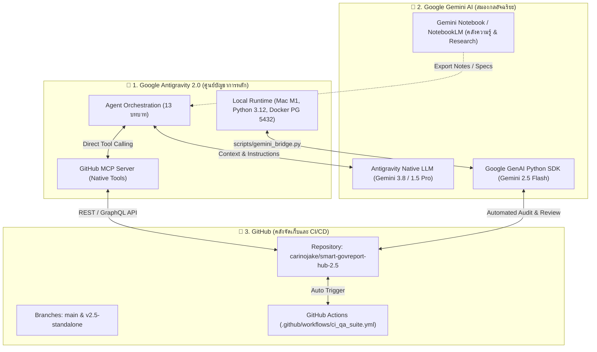

# 🏛️ คู่มือการเชื่อมโยงระบบ 3 ประสาน: GitHub ⟷ Gemini ⟷ Google Antigravity 2.0
### พัฒนาสำหรับ: พี่แจ็ค (Jake) - ระบบ Smart GovReport Hub 2.5

---

## 🎯 สรุปภาพรวมสถาปัตยกรรม (Tri-Pillar Architecture)

การผสานรวม 3 เทคโนโลยีหลักเพื่อสร้างระบบอัตโนมัติสำหรับการพัฒนาซอฟต์แวร์และการบริหารโครงการ:

---

## 🛠️ รายละเอียดการตั้งค่า 3 ส่วน (Configuration Details)

### 1. GitHub Integration (คลังโค้ดและการควบคุมเวอร์ชัน)
- **Authentication:** ผ่าน GitHub CLI (`gh auth login`) บันทึกบน macOS Keychain แบบเข้ารหัส
- **Remote Repo:** `https://github.com/carinojake/smart-govreport-hub-2.5.git`
- **MCP Server:** ติดตั้ง `@modelcontextprotocol/server-github` ลงใน Antigravity (`~/.gemini/config/mcp_config.json`) ผ่าน Wrapper Script อัตโนมัติ (`/Users/jake/.gemini/antigravity/bin/github-mcp.sh`)
- **CI/CD Pipeline:** กำหนดไฟล์ `.github/workflows/ci_qa_suite.yml` เพื่อทดสอบระบบอัตโนมัติทุกครั้งที่มีการ Push

### 2. Gemini Integration (มันสมองและการวิเคราะห์ภาษา)
- **Native Antigravity Engine:** Antigravity ขับเคลื่อนด้วยโมเดล Gemini ในการวางแผนและเขียนโค้ด
- **External Script SDK:** ติดตั้งไลบรารี `google-genai` ใน Virtual Environment (`/Users/Shared/my_ai_project/venv`) โดยอ่าน `GEMINI_API_KEY` โดยตรง
- **Gemini Bridge Utility:** สคริปต์ `scripts/gemini_bridge.py` รองรับการตรวจ Code Review, Security Audit (PDPA, RBAC) และ Changelog อัตโนมัติ
- **Gemini Notebook Bridge:** พื้นที่จัดเก็บเอกสารและข้อกำหนดจาก [Gemini Notebook](https://gemini.google.com/notebook/a9f57981-c5a8-4483-8df2-c92d4e8919df) สามารถบันทึกลงในโฟลเดอร์ `docs/specs/` เพื่อให้ Antigravity นำไปอ้างอิง

### 3. Google Antigravity 2.0 (ศูนย์บัญชาการพัฒนาระบบ)
- **Role Division (13 Personas):**
  - **น้องฟ้า เลขาหน้าห้อง (5.11):** ประสานงาน บันทึกข้อความ จัดการคิวงาน
  - **พี่ใหญ่ PM (5.1):** วางแผน คุมงบประมาณ ตรวจรับงาน
  - **เซียน SA (5.2):** ออกแบบสถาปัตยกรรม ฐานข้อมูล PostgreSQL และ Dynamic RBAC
  - **โค้ดเดอร์หลังบ้าน (5.5):** พัฒนา REST API, FastAPI, Uvicorn, Python
- **Local Dev Server Integration:**
  - Frontend: `http://localhost:8085` (Secure HTTP Server)
  - Backend API: `http://localhost:8086` (FastAPI Uvicorn)
  - Database: `localhost:5432` (Docker PostgreSQL 16)

---

## ⚡ คำสั่งลัดสำหรับการใช้งาน (Quick Command Reference)

| การทำงาน | คำสั่งใน Terminal |
|---|---|
| **ตรวจสอบสถานะเชื่อมต่อ 3 ระบบ** | `python scripts/gemini_bridge.py --status` |
| **รัน AI Code Review ด้วย Gemini** | `python scripts/gemini_bridge.py --review` |
| **รันชุดทดสอบระบบอัตโนมัติ** | `pytest test_rbac_integration.py test_integration.py` |
| **ส่งโค้ดขึ้น GitHub** | `git add . && git commit -m "update" && git push origin main` |

---
