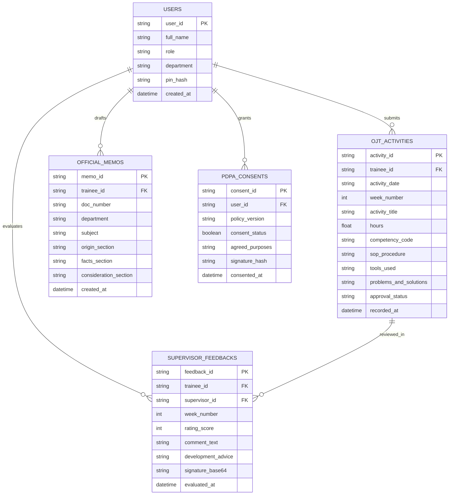
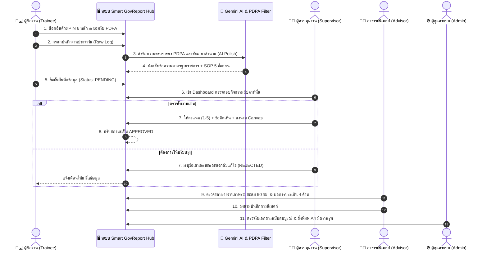

# รายงานจัดทำระบบแบบสมบูรณ์และสถาปัตยกรรมทางเทคนิค
## (System Implementation & Technical Architecture Report)

**โครงการ:** ระบบบริหารจัดการและรายงานผลการปฏิบัติงานอัจฉริยะ (Smart GovReport Hub / OJT Report System)  
**หน่วยงานผู้รับผิดชอบ:** สำนักงานดิจิทัลภาครัฐต้นแบบ (Generic Government Agency)  
**ระดับชั้นความลับ:** ทั่วไป (Public / Internal Official Use)  
**เวอร์ชันเอกสาร:** 1.0 (สมบูรณ์ส่งมอบงาน)  
**วันที่ส่งมอบ:** กันยายน 2569  

---

## สารบัญ (Table of Contents)

1. [บทที่ 1: บทนำและวัตถุประสงค์โครงการ (Project Overview)](#บทที่-1-บทนำและวัตถุประสงค์โครงการ-project-overview)
   - 1.1 ความเป็นมาและสภาพปัญหาเดิม (Background & Problem Statement)
   - 1.2 วัตถุประสงค์โครงการ (Project Objectives)
   - 1.3 ขอบเขตของระบบงาน (Project Scope)
   - 1.4 นิยามศัพท์และตัวย่อ (Glossary & Terminologies)
2. [บทที่ 2: สถาปัตยกรรมและเทคโนโลยีที่เลือกใช้ (System Architecture & Tech Stack)](#บทที่-2-สถาปัตยกรรมและเทคโนโลยีที่เลือกใช้-system-architecture--tech-stack)
   - 2.1 สถาปัตยกรรมภาพรวมแบบไฮบริด (Hybrid Dual-Tier Architecture)
   - 2.2 โครงสร้างระบบหลัก Tier 1 (Production Core Engine)
   - 2.3 โครงสร้างระบบทางเลือก Tier 2 (Serverless Zero-Cost Tier)
   - 2.4 การบูรณาการปัญญาประดิษฐ์ (GenAI Integration via Google Gemini)
   - 2.5 สัญญาเชื่อมต่อข้อมูล (API Specification & JSON Payloads)
3. [บทที่ 3: โครงสร้างข้อมูลและการออกแบบฐานข้อมูล (Data Schema & Database Design)](#บทที่-3-โครงสร้างข้อมูลและการออกแบบฐานข้อมูล-data-schema--database-design)
   - 3.1 แบบจำลองความสัมพันธ์ข้อมูล (Entity-Relationship Diagram - ERD)
   - 3.2 พจนานุกรมข้อมูล (Data Dictionary)
   - 3.3 กลยุทธ์การจัดทำดัชนีและการแบ่งส่วนข้อมูล (Indexing & Partitioning)
4. [บทที่ 4: กระบวนการทำงาน ผังสิทธิ์ และความมั่นคงปลอดภัย (Workflow & Security)](#บทที่-4-กระบวนการทำงาน-ผังสิทธิ์-และความมั่นคงปลอดภัย-workflow--security)
   - 4.1 แผนผังกระบวนการบันทึกและอนุมัติงาน (Approval Workflow)
   - 4.2 การควบคุมสิทธิ์การเข้าถึงแบบจำแนกบทบาท (Role-Based Access Control - RBAC)
   - 4.3 กลไกความมั่นคงปลอดภัยและการพิสูจน์ตัวตน (Authentication & Security Guards)
   - 4.4 มาตรการคุ้มครองข้อมูลส่วนบุคคล (PDPA Compliance & Sanitizer Engine)
5. [บทที่ 5: ฟังก์ชันอัจฉริยะและการพัฒนาต่อยอด (Smart Features & Future Roadmap)](#บทที่-5-ฟังก์ชันอัจฉริยะและการพัฒนาต่อยอด-smart-features--future-roadmap)
   - 5.1 ฟังก์ชัน AI Polish แปลงภาษากิจวัตรสู่สำนวนราชการ
   - 5.2 ระบบสร้างเอกสารราชการ A4 พร้อมพิมพ์อัตโนมัติ (Automated GovPrint Engine)
   - 5.3 แผนงานพัฒนาสู่คลาวด์กลางภาครัฐ (Government Data Center and Cloud - GDCC)

---

## บทที่ 1: บทนำและวัตถุประสงค์โครงการ (Project Overview)

### 1.1 ความเป็นมาและสภาพปัญหาเดิม (Background & Problem Statement)
ในบริบทการปฏิบัติราชการและการฝึกอบรม/ฝึกงานทางวิชาชีพ (On-the-Job Training - OJT) กรอบระยะเวลา 90 ชั่วโมงของหน่วยงานภาครัฐ กระบวนการติดตาม บันทึก และประเมินผลการปฏิบัติงานในอดีตประสบปัญหาสำคัญ 4 ประการ:
1. **การบันทึกในรูปแบบกระดาษ (Paper-based Inefficiency):** การจัดทำสมุดบันทึกการปฏิบัติงานรายวัน (Logbook) บนกระดาษ เกิดความล่าช้า สูญหายง่าย และไม่สามารถตรวจสอบย้อนหลัง (Audit Trail) แบบเรียลไทม์ได้
2. **ปัญหาสำนวนภาษาไม่เป็นทางการ (Informal Language Gap):** ผู้ฝึกงานหรือเจ้าหน้าที่ใหม่มักบันทึกด้วยภาษาพูด ขาดการใช้ศัพท์บัญญัติและโครงสร้างประโยคตามระเบียบสำนักนายกรัฐมนตรีว่าด้วยงานสารบรรณ พ.ศ. 2526 และที่แก้ไขเพิ่มเติม ทำให้ผู้ควบคุมงานต้องเสียเวลาแก้ไขร่างบันทึกข้อความราชการ
3. **ภาระงานในการสรุปและคำนวณชั่วโมง (Consolidation Burden):** การรวบรวมชั่วโมงสะสมให้ครบ 90 ชั่วโมง การจัดกลุ่มตามสมรรถนะ 4 ด้าน และการส่งต่อรายงานให้อาจารย์นิเทศก์ตรวจสอบ ทำได้ล่าช้า ไม่ทันต่อรอบการประเมิน
4. **ความเสี่ยงต่อการละเมิดข้อมูลส่วนบุคคล (PDPA Vulnerability):** การถ่ายภาพหน้างานหรือการพิมพ์บันทึกการทำงานมักมีข้อมูลส่วนบุคคลอ่อนไหว (เช่น เลขประจำตัวประชาชน 13 หลัก, หมายเลขโทรศัพท์, ข้อมูลสิทธิการรักษา) หลุดรอดเข้าสู่ระบบรายงานสาธารณะ

### 1.2 วัตถุประสงค์โครงการ (Project Objectives)
1. เพื่อพัฒนาระบบบันทึกและบริหารจัดการการปฏิบัติงาน OJT แบบดิจิทัล 100% ที่รองรับการทำงานผ่านเว็บเบราว์เซอร์
2. เพื่อประยุกต์ใช้โมเดลภาษาขนาดใหญ่ (Large Language Model - LLM) ในการตรวจจับความถูกต้อง ขัดเกลาสำนวนภาษาราชการ (AI Polish) และตัดข้อมูลส่วนบุคคล (PDPA Masking) โดยอัตโนมัติ
3. เพื่อสร้างกลไกการอนุมัติและประเมินผลแบบ 4 บทบาท (Trainee, Supervisor, Advisor, Admin) พร้อมระบบลงลายมือชื่อดิจิทัล (Digital Canvas Signature)
4. เพื่อรองรับการจัดทำเอกสารราชการขนาด A4 ที่มีตราครุฑถูกต้องตามระเบียบงานสารบรรณฯ และสั่งพิมพ์ได้ทันที

### 1.3 ขอบเขตของระบบงาน (Project Scope)
- **กลุ่มเป้าหมายผู้ใช้งาน:** ครอบคลุม 4 บทบาทหลักในสังกัด ได้แก่ ผู้ฝึกงาน/ผู้ปฏิบัติงาน, ผู้ควบคุมงาน/พี่เลี้ยง, อาจารย์นิเทศก์/ผู้ตรวจการ, และเจ้าหน้าที่ผู้ดูแลระบบ
- **เกณฑ์เวลาและสมรรถนะ:** รองรับการสะสมเวลาการปฏิบัติงานรวม 90 ชั่วโมง (วันละ 7.0 - 8.0 ชั่วโมง จำนวน 12-13 วันทำการ) จำแนกตาม 4 สมรรถนะหลักภาครัฐ:
  1. `IT-01 / IT-02`: งานสนับสนุนเทคนิค ฮาร์ดแวร์ และเครือข่าย (IT Infrastructure & Troubleshooting)
  2. `GOV-01`: งานสารบรรณอิเล็กทรอนิกส์และเอกสารราชการ (e-Saraban & Official Workflow)
  3. `DATA-01`: งานจัดการฐานข้อมูล การประมวลผล และสเปรดชีต (Data Management & Analytics)
  4. `SEC-01`: งานคุ้มครองข้อมูลส่วนบุคคลและความมั่นคงปลอดภัยไซเบอร์ (PDPA & Cyber Hygiene)

### 1.4 นิยามศัพท์และตัวย่อ (Glossary & Terminologies)
| คำศัพท์ / ตัวย่อ | ความหมาย |
| :--- | :--- |
| **OJT** | On-the-Job Training: การเรียนรู้และฝึกปฏิบัติงานในสถานที่ทำงานจริง |
| **RBAC** | Role-Based Access Control: การควบคุมสิทธิ์การเข้าถึงข้อมูลตามบทบาทหน้าที่ |
| **PDPA** | Personal Data Protection Act: พระราชบัญญัติคุ้มครองข้อมูลส่วนบุคคล พ.ศ. 2562 |
| **LLM** | Large Language Model: ปัญญาประดิษฐ์โครงข่ายประสาทขนาดใหญ่สำหรับการประมวลผลภาษาธรรมชาติ |
| **SOP** | Standard Operating Procedure: ขั้นตอนมาตรฐานการปฏิบัติงาน |
| **Audit Trail** | ข้อมูลบันทึกประวัติการทำธุรกรรมหรือแก้ไขข้อมูลที่ไม่สามารถลบหรือดัดแปลงย้อนหลังได้ |

---

## บทที่ 2: สถาปัตยกรรมและเทคโนโลยีที่เลือกใช้ (System Architecture & Tech Stack)

ระบบ Smart GovReport Hub ออกแบบด้วยแนวคิด **Modular & Cost-Effective Hybrid Architecture** เพื่อให้สามารถปรับใช้ได้ทั้งในหน่วยงานที่มีเซิร์ฟเวอร์เฉพาะ (On-Premises / Private Cloud) และหน่วยงานย่อยที่ต้องการระบบทำงานแบบ Zero-Cost

```
+-----------------------------------------------------------------------------+
|                            PRESENTATION TIER                                |
|  - Modern Web Dashboard (HTML5 / TailwindCSS / Alpine.js)                   |
|  - A4 GovReport Print Engine (CSS Paged Media @page, Garuda Emblem 3.0cm)   |
|  - Digital Canvas Signature Module (HTML5 Canvas Base64 Export)             |
+-----------------------------------------------------------------------------+
                                      |
                     RESTful JSON API | HTTPS (TLS 1.3)
                                      v
+-----------------------------------------------------------------------------+
|                        APPLICATION & BUSINESS LOGIC                         |
|  [Tier 1: Production Core]                  [Tier 2: Serverless Alt]        |
|  - Python FastAPI / Flask                   - Google Apps Script (GAS)      |
|  - Pydantic v2 Strict Validation            - Web App doGet/doPost Hook     |
|  - PDPASanitizer Dual-Filter Engine         - Client-side Hash Check        |
+-----------------------------------------------------------------------------+
          |                                                   |
          | Native SDK Calls                                  | Spreadsheet API
          v                                                   v
+-----------------------------+             +---------------------------------+
|      INTELLIGENCE LAYER     |             |          DATA STORAGE           |
| - Google Gemini 1.5 Flash   |             | - Tier 1: SQLite WAL / Postgres |
| - Temp=0.2, Top-P=0.95      |             | - Tier 2: Google Sheets DB      |
| - Fallback Model Sequence   |             | - Append-only Audit Log (.jsonl)|
+-----------------------------+             +---------------------------------+
```

### 2.1 สถาปัตยกรรมภาพรวมแบบไฮบริด (Hybrid Dual-Tier Architecture)

| มิติการเปรียบเทียบ | Tier 1: Production Core (ระบบหลัก) | Tier 2: Serverless (ระบบทางเลือก) |
| :--- | :--- | :--- |
| **Backend Runtime** | Python 3.12 (FastAPI / Flask) | Google Apps Script (V8 Engine) |
| **Database** | SQLite 3 (WAL Mode) / PostgreSQL 15 | Google Sheets (Multi-tabs as Tables) |
| **AI Integration** | Google GenAI SDK (Gemini 1.5 Flash) | Google AI Studio REST Fetch in GAS |
| **Hosting Platform**| Docker Container / Local Server / VPS | GitHub Pages + Google Cloud Infrastructure |
| **งบประมาณรายเดือน**| ต่ำมาก (0 - 300 บาท/เดือน) | **0 บาท (Zero-Cost ตลอดการใช้งาน)** |
| **ปริมาณคำขอ (Req)**| $\ge 1,000$ คำขอ/นาที | 30 - 50 คำขอ/นาที (ตามโควตา Google) |
| **ความเหมาะสม** | หน่วยงานระดับกรม/กอง/ศูนย์เทคโนโลยี | หน่วยงานย่อย, ศูนย์ฝึกอบรมภูมิภาค, สวนงาน |

### 2.2 โครงสร้างระบบหลัก Tier 1 (Production Core Engine)
1. **Application Server:** พัฒนาด้วย Python 3.12 โดยใช้โครงสร้าง Asynchronous / REST API ผ่าน Pydantic Schema เพื่อรับประกัน Type-Safety
2. **PDPA Sanitizer Filter:** ชั้นกรองข้อความก่อนส่งออกนอกระบบ (Pre-flight Filter) สแกนด้วย Regular Expressions ขั้นสูงเพื่อบดบังข้อมูลส่วนบุคคล
3. **Database Layer:** ใช้ SQLite ในโหมด Write-Ahead Logging (WAL) ซึ่งรองรับ Concurrency สูงโดยไม่เกิดการล็อกตาราง สามารถสลับไปใช้ Docker PostgreSQL ได้ทันทีผ่านการสลับ Connection String

### 2.3 การบูรณาการปัญญาประดิษฐ์ (GenAI Integration)
ระบบเลือกใช้โมเดล **Google Gemini 1.5 Flash** ผ่าน Google GenAI SDK ด้วยเหตุผลความคุ้มค่าและความเร็วในการตอบสนอง:
- **Parameter Configurations:**
  - `Temperature: 0.2` (ลดการเพ้อพวง/Hallucination ให้คำตอบคงเส้นคงวาและเป็นทางการ)
  - `Top-P: 0.95`, `Top-K: 40`
  - `Response Schema`: บังคับโครงสร้าง JSON (Structured Output) ตาม Pydantic Model
- **Reliability & Fallback Matrix:**
  กรณีโมเดลหลักประสบปัญหาโควตา (HTTP 429 Too Many Requests) ระบบมีกลไก `_call_with_fallback()` สลับไปยัง `gemini-1.5-flash-8b` หรือระบบ Local Rule-based Sanitizer โดยอัตโนมัติ

### 2.4 สัญญาเชื่อมต่อข้อมูล (API Specification)

#### 1. การพิสูจน์ตัวตนด้วย PIN (PIN Authentication)
- **Endpoint:** `POST /api/v1/auth/pin-login`
- **Request Body:**
```json
{
  "pin": "123456"
}
```
- **Response (200 OK):**
```json
{
  "status": "success",
  "user": {
    "user_id": "usr_jake",
    "full_name": "นายธนกฤต วิโรจน์กุล (พี่แจ็ค)",
    "role": "trainee",
    "department": "ส่วนพัฒนาระบบดิจิทัล สำนักงานดิจิทัลภาครัฐ",
    "position": "นักศึกษาฝึกงาน/ผู้ปฏิบัติงาน OJT"
  }
}
```

#### 2. การขัดเกลาภาษาราชการ (AI Polish)
- **Endpoint:** `POST /api/v1/ai/polish`
- **Request Body:**
```json
{
  "raw_text": "วันนี้ช่วยพี่ติดตั้งวินโดว์ใหม่ให้ฝ่ายการเงินแล้วก็สอนเขาใช้เอ็กเซลสรุปงบ",
  "mode": "standard"
}
```
- **Response (200 OK):**
```json
{
  "status": "success",
  "engine": "gemini-1.5-flash",
  "result": "ดำเนินการติดตั้งและกำหนดค่าระบบปฏิบัติการ Windows สำหรับเครื่องคอมพิวเตอร์ลูกข่ายฝ่ายการเงิน พร้อมทั้งให้คำแนะนำเชิงเทคนิคการประยุกต์ใช้โปรแกรม Microsoft Excel ในการจัดทำรายงานสรุปงบประมาณ เพื่อสนับสนุนประสิทธิภาพการปฏิบัติราชการ",
  "pdpa_redactions_count": 0
}
```

---

## บทที่ 3: โครงสร้างข้อมูลและการออกแบบฐานข้อมูล (Data Schema & Database Design)

### 3.1 แบบจำลองความสัมพันธ์ข้อมูล (Entity-Relationship Diagram)



### 3.2 พจนานุกรมข้อมูล (Data Dictionary)

#### ตารางที่ 1: `users` (ตารางข้อมูลผู้ใช้งานและผังสิทธิ์)
| ชื่อฟิลด์ | ชนิดข้อมูล | เงื่อนไข | คำอธิบาย |
| :--- | :--- | :--- | :--- |
| `user_id` | VARCHAR(64) | Primary Key | รหัสประจำตัวผู้ใช้ (เช่น `usr_jake`, `sup_pm_it`) |
| `full_name` | VARCHAR(255) | NOT NULL | ชื่อ-นามสกุลทางการ |
| `role` | VARCHAR(32) | NOT NULL | บทบาท (`trainee`, `supervisor`, `advisor`, `admin`) |
| `department`| VARCHAR(255) | NOT NULL | สังกัดกอง/ฝ่าย/สำนัก |
| `pin_hash` | VARCHAR(128) | NOT NULL | แฮชรหัสผ่านตัวเลข 6 หลัก (Argon2 / SHA-256 Salted) |
| `is_active` | BOOLEAN | DEFAULT TRUE| สถานะเปิดใช้งานบัญชี |
| `created_at`| TIMESTAMP | DEFAULT NOW | วันที่เวลาสร้างระเบียน |

#### ตารางที่ 2: `ojt_activities` (ตารางบันทึกกิจกรรมรายวัน)
| ชื่อฟิลด์ | ชนิดข้อมูล | เงื่อนไข | คำอธิบาย |
| :--- | :--- | :--- | :--- |
| `activity_id`| VARCHAR(64) | Primary Key | รหัสกิจกรรม (UUID หรือ Prefix Gen) |
| `trainee_id` | VARCHAR(64) | Foreign Key | เชื่อมโยงไปยัง `users.user_id` |
| `activity_date`| VARCHAR(64) | NOT NULL | วันที่ปฏิบัติงาน (รูปแบบไทย เช่น 5 กันยายน 2569) |
| `week_number`| INTEGER | NOT NULL | สัปดาห์ที่ปฏิบัติงาน (1 ถึง 4) |
| `activity_title`| TEXT | NOT NULL | ชื่องาน/กิจกรรมทางการที่ผ่าน AI Polish |
| `hours` | DECIMAL(3,1) | NOT NULL | จำนวนชั่วโมง (ค่าปกติ 7.0 หรือ 8.0) |
| `competency_code`| VARCHAR(32) | NOT NULL | รหัสสมรรถนะ (`IT-01`, `GOV-01`, `DATA-01`, `SEC-01`) |
| `sop_procedure`| TEXT | NOT NULL | ขั้นตอนการปฏิบัติงาน 3-5 ข้อ (SOP) |
| `tools_used` | TEXT | NULL | อุปกรณ์ ฮาร์ดแวร์ หรือโปรแกรมที่ใช้ |
| `problems_and_solutions`| TEXT | NULL | ปัญหาและแนวทางแก้ไข |
| `approval_status`| VARCHAR(32) | DEFAULT 'pending'| สถานะการตรวจรับ (`pending`, `approved`, `rejected`) |
| `recorded_at`| TIMESTAMP | DEFAULT NOW | วันเวลาที่บันทึกข้อมูล |

#### ตารางที่ 3: `supervisor_feedbacks` (ตารางการประเมินของผู้ควบคุมงาน)
| ชื่อฟิลด์ | ชนิดข้อมูล | เงื่อนไข | คำอธิบาย |
| :--- | :--- | :--- | :--- |
| `feedback_id`| VARCHAR(64) | Primary Key | รหัสผลการประเมิน |
| `trainee_id` | VARCHAR(64) | Foreign Key | รหัสผู้ฝึกงานที่รับการประเมิน |
| `supervisor_id`| VARCHAR(64) | Foreign Key | รหัสผู้ควบคุมงานผู้ประเมิน |
| `week_number`| INTEGER | NOT NULL | สัปดาห์ที่ทำการประเมิน (1-4) |
| `rating_score`| INTEGER | CHECK (1-5) | คะแนนการประเมินระดับ 1 (ปรับปรุง) ถึง 5 (ดีเยี่ยม) |
| `comment_text`| TEXT | NOT NULL | ความเห็นเชิงสร้างสรรค์ของผู้ควบคุมงาน |
| `development_advice`| TEXT | NULL | ข้อเสนอแนะเพื่อการพัฒนาสมรรถนะ |
| `signature_base64`| LONGTEXT | NOT NULL | ข้อมูลภาพลายมือชื่ออิเล็กทรอนิกส์ Base64 |
| `evaluated_at`| TIMESTAMP | DEFAULT NOW | วันเวลาที่บันทึกผลการประเมิน |

#### ตารางที่ 4: `pdpa_consents` (ตารางบันทึกความยินยอมตาม พ.ร.บ. คุ้มครองข้อมูลส่วนบุคคล)
| ชื่อฟิลด์ | ชนิดข้อมูล | เงื่อนไข | คำอธิบาย |
| :--- | :--- | :--- | :--- |
| `consent_id` | VARCHAR(64) | Primary Key | รหัสบันทึกความยินยอม |
| `user_id` | VARCHAR(64) | Foreign Key | รหัสผู้ใช้งาน |
| `policy_version`| VARCHAR(32) | NOT NULL | เวอร์ชันนโยบายความเป็นส่วนตัว (เช่น `v1.2-2026`) |
| `consent_status`| BOOLEAN | NOT NULL | สถานะการให้ความยินยอม (TRUE = ยินยอม) |
| `agreed_purposes`| TEXT | NOT NULL | วัตถุประสงค์ที่ยินยอม (JSON Array: `daily_log`, `photos`) |
| `signature_hash`| VARCHAR(255) | NOT NULL | ลายเซ็นดิจิทัลแฮชเพื่อป้องกันการปฏิเสธความรับผิดชอบ |
| `consented_at`| TIMESTAMP | DEFAULT NOW | วันเวลาที่กดยินยอม |

---

## บทที่ 4: กระบวนการทำงาน ผังสิทธิ์ และความมั่นคงปลอดภัย (Workflow & Security)

### 4.1 แผนผังกระบวนการบันทึกและอนุมัติงาน (Approval Workflow)



### 4.2 การควบคุมสิทธิ์การเข้าถึงตามบทบาท (Role-Based Access Control - RBAC)

| เมนูและฟังก์ชันงาน | Trainee | Supervisor | Advisor | Admin |
| :--- | :---: | :---: | :---: | :---: |
| บันทึกกิจกรรมประจำวันของตนเอง | ✅ | ❌ | ❌ | ✅ |
| ใช้งาน AI Polish และ PDPA Sanitizer | ✅ | ✅ | ❌ | ✅ |
| ดูข้อมูลบันทึกกิจกรรมของผู้ฝึกงานคนอื่น | ❌ (Data Isolation) | ✅ (เฉพาะสายงาน) | ✅ (ทุกคนที่นิเทศก์) | ✅ (ทุกคน) |
| ให้คะแนน ลงความเห็น และอนุมัติงาน | ❌ | ✅ | ❌ | ✅ |
| บันทึกผลการนิเทศก์และสมรรถนะ | ❌ | ❌ | ✅ | ✅ |
| จัดการเพิ่ม/ระงับบัญชีผู้ใช้งาน | ❌ | ❌ | ❌ | ✅ |
| สั่งพิมพ์และส่งออกรายงานราชการ A4 | ✅ (ของตนเอง) | ✅ (ของลูกทีม) | ✅ (ของผู้รับนิเทศก์) | ✅ (ทั้งหมด) |

### 4.3 กลไกความมั่นคงปลอดภัยและการพิสูจน์ตัวตน (Security Architecture)
1. **การรักษาความปลอดภัยของรหัสผ่าน:** ใช้รหัสผ่านหรือ PIN 6 หลักที่เข้ารหัสด้วย Salted SHA-256/Argon2 ป้องกันการรั่วไหลแบบ Clear-text
2. **ระบบป้องกัน Brute-Force:** กำหนดขีดจำกัดการกรอกผิดไม่เกิน 5 ครั้งต่อ 15 นาที พร้อมบันทึก IP Address ลงใน Audit Log
3. **Data Isolation by Tenant/User:** ในระดับ SQL Query มีการบังคับใส่เงื่อนไข `WHERE trainee_id = :current_user` เสมอ เพื่อป้องกันปัญหา Insecure Direct Object References (IDOR) ดังที่ผ่านการทดสอบใน `test_integration.py`
4. **Immutable Audit Trail:** กิจกรรมสำคัญ เช่น การให้ความยินยอม PDPA, การลงนามของผู้ควบคุมงาน จะถูกเขียนลงไฟล์ JSON Lines แบบ Append-only (`logs/pdpa_audit.jsonl`) ซึ่งห้ามแก้ไขย้อนหลัง

### 4.4 เครื่องมือคุ้มครองข้อมูลส่วนบุคคล (PDPA Sanitizer Engine)
ระบบมีฟังก์ชัน Regular Expression อัจฉริยะที่สแกนและบดบัง (Masking) ข้อมูลส่วนบุคคลก่อนที่ข้อมูลจะถูกส่งไปยัง Gemini API หรือบันทึกจัดเก็บ:
- **เลขประจำตัวประชาชน 13 หลัก:** แปลงเป็น `[REDACTED_NATIONAL_ID]`
- **หมายเลขโทรศัพท์ (มือถือ/พื้นฐาน):** แปลงเป็น `[REDACTED_PHONE]`
- **ที่อยู่อีเมล:** แปลงเป็น `[REDACTED_EMAIL]`
- **ข้อมูลอ่อนไหวทางการแพทย์/ศาสนา:** แปลงเป็น `[REDACTED_SENSITIVE_DATA]`

---

## บทที่ 5: ฟังก์ชันอัจฉริยะและการพัฒนาต่อยอด (Smart Features & Future Roadmap)

### 5.1 ฟังก์ชัน AI Polish แปลงภาษากิจวัตรสู่สำนวนราชการ
ระบบออกแบบ System Prompt โดยอิงตามแนวทางหนังสือราชการของสำนักงาน ก.พ. และระเบียบสำนักนายกรัฐมนตรีฯ โดยมีข้อกำหนด:
- เปลี่ยนคำสรรพนามบุรุษที่ 1 เป็นการระบุการกระทำโดยตรง เช่น "ผมทำ..." เป็น "ดำเนินการ..."
- แทนที่คำทับศัพท์ภาษาอังกฤษด้วยศัพท์บัญญัติราชการที่เหมาะสม (เช่น "เทรนโมเดล" $\rightarrow$ "ดำเนินการฝึกสอนแบบจำลองปัญญาประดิษฐ์", "ฟิกบั๊ก" $\rightarrow$ "ดำเนินการตรวจสอบและแก้ไขข้อผิดพลาดของชุดคำสั่ง")
- แยกขั้นตอนการปฏิบัติงานออกเป็นรูปแบบ Standard Operating Procedure (SOP) 3 ถึง 5 ขั้นตอนโดยอัตโนมัติ

### 5.2 ระบบสร้างเอกสารราชการ A4 พร้อมพิมพ์อัตโนมัติ (Automated GovPrint Engine)
เอกสารรายงานสรุปผล OJT ถูกออกแบบด้วย CSS Paged Media (`@page { size: A4 portrait; margin: 20mm; }`):
- **ตราครุฑมาตรฐาน:** แสดงตราครุฑขนาดความสูง 3.0 เซนติเมตรตรงกึ่งกลางหน้าตามระเบียบสารบรรณ
- **ฟอนต์มาตรฐาน:** ใช้ TH Sarabun PSK / TH Sarabun New ขนาด 16pt (ข้อความปกติ) และ 20pt (หัวเรื่อง)
- **การขึ้นหน้าใหม่อัตโนมัติ:** ควบคุมด้วย `page-break-inside: avoid` ป้องกันไม่ให้ตารางสรุปคะแนนหรือส่วนลงนามขาดแยกจากกันคนละหน้า

### 5.3 แผนงานพัฒนาสู่คลาวด์กลางภาครัฐ (Government Data Center and Cloud - GDCC)
เพื่อรองรับการขยายผลในระดับกระทรวงหรือทุกหน่วยงานภาครัฐ แผนการพัฒนาในอนาคตกำหนดไว้ดังนี้:
1. **ระยะสั้น (ไตรมาส 4/2569):** เพิ่มการรองรับการยืนยันตัวตนผ่านแอปพลิเคชัน **ThaID** ของกรมการปกครอง
2. **ระยะกลาง (ปี 2570):** นำระบบขึ้นสู่แพลตฟอร์มคลาวด์กลางภาครัฐ (GDCC) พร้อมระบบเชื่อมโยงข้อมูลผ่าน Government Data Exchange (GDX)
3. **ระยะยาว (ปี 2571):** พัฒนาระบบประเมินสมรรถนะผู้ปฏิบัติงานอัตโนมัติ (Automated Competency Analytics) โดยประมวลผลข้อมูล Logbook ย้อนหลังเพื่อชี้เป้าทักษะที่ต้องพัฒนา (Upskill/Reskill)

---

**ลงนามรับรองความถูกต้องของรายงานสถาปัตยกรรม:**

(......................................................)  
**เซียน SA (5.2)** — หัวหน้าทีมสถาปัตยกรรมระบบ  

(......................................................)  
**พี่ใหญ่ PM (5.1)** — ผู้อำนวยการบริหารโครงการ  
สำนักงานดิจิทัลภาครัฐต้นแบบ
